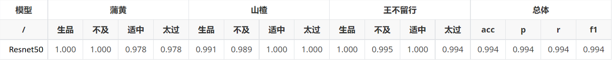

# 中药炮制饮片质量判断模型

## 目录

- 使用说明
- 实验结果
- 贡献

## 使用说明

### 1、安装依赖

> mindspore 1.8.1
>
> Pillow 9.2.0
>
> numpy 1.21.6
>
> scikit-learn 1.0.2
>
> matplotlib 3.5.2
> 
> download 0.3.5

### 2、准备数据集

如果使用的华为算力启智平台，请创建调试任务加载本项目数据集，并修改对应代码。

组织你的数据集文件夹，如下所示：

> |-- dataset/
> |   |-- train/
> |       |-- class_name/
> |            |-- image_1.jpg
> |            |-- iamge_2.jpg
> |            |-- ...
> |
> |   |-- test/
> |       |-- class_name/
> |            |-- image_1.jpg
> |            |-- iamge_2.jpg
> |            |-- ...

### 3、运行代码
项目提供两种运行方式

1）打开.ipynb文件，并按照文件中的说明逐步执行代码。根据需要，您可以根据自己的数据集进行必要的修改和调整。

> 1、数据预处理[2-4]
>
> 该部分是对数据集进行简单的预处理，主要包括数据集下载、图片resize和数据集划分
>
> - 如果使用的是启智平台调试任务，可以将url修改用以下载数据集[2]
>
> - 图片resize到((1000,1000))为可选[3]
>
> 2、加载数据集[3-9]
>
> 该部分加载图片并做了简单的数据增强
>
> - 需要修改data_dir为数据集路径[6]
>
> 3、网络定义[10-16]
>
> 该部分定义了分类模型。
>
> 4、模型训练[17-20]
>
> 该部分加载网络，并定义了优化器和损失函数
>
> - 超参数epoch,patience,lr都可以根据情况自己设置[18]
>
> 5、模型推理[21-27]
>
> 该部分定义了测试集、单张图片推理两种方法，用于加载训练好的模型进行推理。

2）运行sh脚本文件，文件中简单编写python程序的执行方式，您可以根据实际进行调整

> 1、模型训练
>
> sh ./run_train.sh
>
> 2、模型推理
>
> sh ./run_predict.sh

## 实验结果

#### 中医药数据集

## 参考文献

    [1] He, K., Zhang, X., Ren, S., & Sun, J. (2016). Deep residual learning for image recognition. In Proceedings of the IEEE conference on computer vision and pattern recognition (pp. 770-778).

